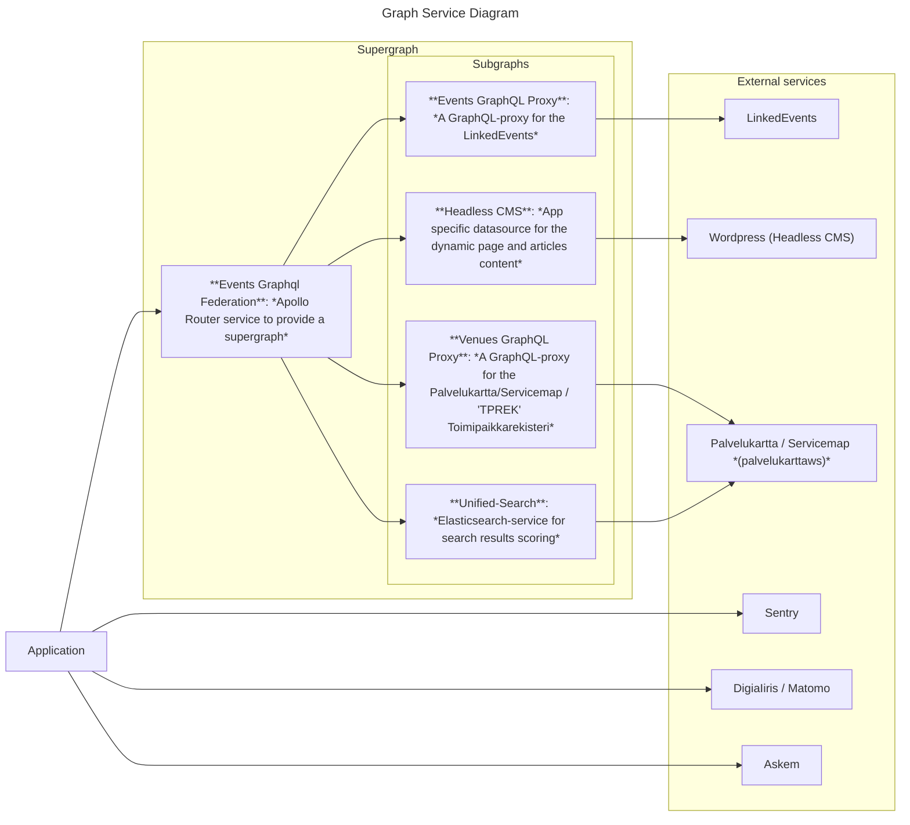

<div align="center">
  <h1 align="center"><a aria-label="Helsinki Events Monorepo" href="https://github.com/City-of-Helsinki/events-helsinki-monorepo">Helsinki Events Monorepo</a></h1>
  <p align="center"><strong>A monorepo for event-search based nextjs applications and common event components</strong></p>
</div>
<p align="center">
  <a aria-label="Codacy grade" href="https://www.codacy.com/gh/City-of-Helsinki/events-helsinki-monorepo/dashboard?utm_source=github.com&amp;utm_medium=referral&amp;utm_content=City-of-Helsinki/events-helsinki-monorepo&amp;utm_campaign=Badge_Grade">
    
  </a>
  <a aria-label="LoC">  
    
  </a>
  <a aria-label="Top language" href="https://github.com/City-of-Helsinki/events-helsinki-monorepo/search?l=typescript">
    
  </a>
  <a aria-label="Licence" href="https://github.com/City-of-Helsinki/events-helsinki-monorepo/blob/main/LICENSE">
    
  </a>
</p>

<!-- START doctoc generated TOC please keep comment here to allow auto update -->
<!-- DON'T EDIT THIS SECTION, INSTEAD RE-RUN doctoc TO UPDATE -->

- [1. Architecture](#1-architecture)
- [2. Structure](#2-structure)
  - [2.1 Proxies](#21-proxies)
  - [2.2 Apps](#22-apps)
  - [2.3 Configuration](#23-configuration)
  - [2.4 Shared packages](#24-shared-packages)
  - [2.5 Shared static assets](#25-shared-static-assets)
  - [2.6 Folder overview](#26-folder-overview)
- [3. Monorepo essentials](#3-monorepo-essentials)
  - [3.1 Monorepo scripts](#31-monorepo-scripts)
  - [3.2 Maintaining deps updated](#32-maintaining-deps-updated)
  - [3.3 Symbolic links](#33-symbolic-links)
    - [Supporting symbolic links on Windows](#supporting-symbolic-links-on-windows)
  - [3.4 Critical HDS Styles](#34-critical-hds-styles)
- [4. Incremental Static Regeneration on-demand revalidation](#4-incremental-static-regeneration-on-demand-revalidation)
  - [4.1 Trigger revalidate all](#41-trigger-revalidate-all)
  - [4.2 Trigger revalidate for the uri](#42-trigger-revalidate-for-the-uri)
  - [4.3 Updating pages and articles in CMS](#43-updating-pages-and-articles-in-cms)
- [5. Quality](#5-quality)
  - [5.1 Linters](#51-linters)
  - [5.2 Hooks / Lint-staged](#52-hooks--lint-staged)
  - [5.3 Tests](#53-tests)
  - [5.4 CI](#54-ci)
    - [Pipeline static testing](#pipeline-static-testing)
    - [Pipeline triggering](#pipeline-triggering)
    - [Pipeline configuration](#pipeline-configuration)
    - [Public service environments](#public-service-environments)
- [6. Development](#6-development)
  - [6.1 Quick start](#61-quick-start)
  - [6.2 Editor support](#62-editor-support)
    - [VSCode](#vscode)
- [7. Deploy](#7-deploy)
- [8. Releases, changelogs and versioning](#8-releases-changelogs-and-versioning)
  - [8.1 Conventional Commits](#81-conventional-commits)
  - [8.2 Releasable units](#82-releasable-units)
  - [8.3 Configuration](#83-configuration)
  - [8.4 Troubleshoting release-please](#84-troubleshoting-release-please)
    - [Fix merge conflicts by running release-please -action manually](#fix-merge-conflicts-by-running-release-please--action-manually)
- [9. FAQ](#9-faq)
  - [9.1 Monorepo](#91-monorepo)
    - [Exact vs semver dependencies](#exact-vs-semver-dependencies)

<!-- END doctoc generated TOC please keep comment here to allow auto update -->

> Howtos for monorepo. New to monorepos ? [check this FAQ](./docs/howto/how-to.md).

The Helsinki Events Monorepo is a version control system for three related applications: Events-Helsinki, Hobbies-Helsinki, and Sports-Helsinki. These are React/Next.js-based applications that allow citizens to discover events, courses, hobbies, and activities in Helsinki. The monorepo also contains the shared services, libraries, and components used across these applications.

**Why a Monorepo?**

The primary reason for using a monorepo is to streamline the development and deployment process for our applications. It offers several key advantages:

- **Shared Code and Resources**: Instead of maintaining separate repositories for each app, a monorepo allows us to centralize and easily share common code, components, and services. This reduces duplication and ensures consistency across all three applications.

- **Simplified Dependencies**: With a single repository, managing dependencies between the applications and shared libraries becomes much simpler. Developers can make changes to a shared library and see the effects on all dependent applications in one place.

- **Atomic Commits**: This allows for a single commit that spans multiple projects. For example, a single pull request can include a new feature in a shared library and the corresponding updates in all three applications that use it. This prevents versioning issues and ensures everything works together.

## 1. Architecture

The subgraphs of multiple datasources are combined to a one supergraph with an app specific Apollo-Router instance.
An application (Events, Hobbies, Sports) uses the app specific Apollo-Router so the app gets all the datasources in use with a single Apollo-Client.
All the applications inside the monorepo are sharing the similar Apollo-Router in means of structure, but since there are app specific Headless CMS instances to share app specific data, each of the applications are connected to a unique environment-app-specific router instances.



> NOTE: There is also an [optional feature to cache images](./packages/components/README.md#noteworthy-features)

## 2. Structure

```
.
├── proxies
│   ├── events-graphql-federation (Apollo Router and Gateway)
│   ├── venue-graphql-proxy   Venue graphql api proxy server
│   └── events-graphql-proxy   ("clone of events-helsinki-api-proxy")
│
├── apps
│   ├── hobbies-helsinki  (i18n, ssr, api, vitest)
│   ├── events-helsinki   ("clone of hobbies-helsinki")
│   └── sports-helsinki   ("clone of hobbies-helsinki")
│
└── packages
    ├── common-i18n          (locales...)
    ├── components           (common event components, utils and hooks, storybook, vitest)
    ├── graphql-proxy-server (common code for graphql api-proxy server)
    └── eslint-config-bases  (to shared eslint configs)
```

### 2.1 Proxies

- [proxies/events-graphql-federation](./proxies/events-graphql-federation): The Apollo Router configuration to manage and run subgraphs. [README](./proxies/events-graphql-federation/README.md)
- [proxies/events-graphql-proxy](./proxies/events-graphql-proxy): Clone of events-helsinki-api-proxy. Event Helsinki GraphQL proxy. [README](./proxies/events-graphql-proxy/README.md)
- [proxies/venue-graphql-proxy](./venue/events-graphql-proxy): Venue Helsinki GraphQL proxy. [README](./proxies/venue-graphql-proxy/README.md)

### 2.2 Apps

- [apps/hobbies-helsinki](./apps/hobbies-helsinki): SSR, i18n, sass, graphQL, rest... [README](./apps/hobbies-helsinki/README.md) | [DEMO](https://harrastukset.test.hel.ninja) | [CHANGELOG](./apps/hobbies-helsinki/CHANGELOG.md)
- [apps/events-helsinki](./apps/events-helsinki): Clone of Hobbies (SSR, i18n, sass, graphQL, rest...) [README](./apps/events-helsinki/README.md) | [DEMO](https://tapahtumat.test.hel.ninja) | [CHANGELOG](./apps/events-helsinki/CHANGELOG.md)
- [apps/sports-helsinki](./apps/sports-helsinki): Clone of Hobbies (SSR, i18n, sass, graphQL, rest...) [README](./apps/sports-helsinki/README.md) | [DEMO](https://liikunta.test.hel.ninja) | [CHANGELOG](./apps/sports-helsinki/CHANGELOG.md)

> Apps should not depend on apps, they can depend on packages

### 2.3 Configuration

The application and proxy configuration is done via the AppConfig -file as much as possible, so there would be a single point for all the configuration.

### 2.4 Shared packages

- [packages/eslint-config-bases](./packages/eslint-config-bases): [README](./packages/eslint-config-bases/README.md) | [CHANGELOG](./packages/eslint-config-bases/CHANGELOG.md)
- [packages/graphql-proxy-server](./packages/graphql-proxy-server): [README](./packages/graphql-proxy-server/README.md) | [CHANGELOG](./packages/graphql-proxy-server/CHANGELOG.md)
- [packages/components](./packages/components): publishable. [README](./packages/components/README.md) | [CHANGELOG](./packages/components/CHANGELOG.md)
- [packages/common-i18n](./packages/common-i18n): [README](./packages/common-i18n/README.md) | [CHANGELOG](./packages/common-i18n/CHANGELOG.md)
- [packages/common-tests](./packages/common-tests): [README](./packages/common-tests/README.md) | [CHANGELOG](./packages/common-tests/CHANGELOG.md)

> Apps can depend on packages, packages can depend on each others...

### 2.5 Shared static assets

If needed static resources like **images**,... can be shared by using symlinks in the repo.

- See the global [static](./static) folder.

### 2.6 Folder overview

<details>
<summary>Detailed folder structure</summary>

```
.
├── proxies
│   ├── events-graphql-federation   (Apollo Router and Gateway)
│   ├── events-graphql-proxy        (Apollo Server to offer Graphql endpoint for the LinkedEvents -service)
│   └── venue-graphql-proxy        (Apollo Server to offer Graphql endpoint for the Venue)
│
├── apps
│   └── hobbies-helsinki            (NextJS app with api-routes)
│       ├── public/
│       │   ├── shared-assets/      (possible symlink to global assets)
│       │   └── shared-locales/     (possible symlink to global locales)
│       ├── src/
│       │   └── pages/api           (api routes)
│       ├── CHANGELOG.md
│       ├── next.config.mjs
│       ├── next-i18next.config.mjs
│       ├── package.json            (define package workspace:package deps)
│       └── tsconfig.json           (define path to packages)
│
├── packages
│   ├── common-i18n
│   │   ├── src/
│   │   ├── CHANGELOG.md
│   │   ├── package.json
│   │   └── tsconfig.json
│   │
│   ├── eslint-config-bases
│   │   ├── src/
│   │   ├── CHANGELOG.md
│   │   ├── package.json
│   │   └── tsconfig.json
│   │
│   └── components                  (basic design-system in react)
│       ├── src/
│       ├── CHANGELOG.md
│       ├── package.json
│       └── tsconfig.json
│
├── static                          (no code: images, json, locales,...)
│   ├── assets
│   └── locales
├── .yarnrc.yml
├── .dockerignore
├── docker-compose.nextjs-app.yml   (compose specific for nextjs-app)
├── docker-compose.yml              (optional: general services like postgresql...)
├── Dockerfile                      (multistage build suitable for all apps)
├── package.json                    (the workspace config)
└── tsconfig.base.json              (base typescript config)
```

</details>

## 3. Monorepo essentials

### 3.1 Monorepo scripts

Some convenience scripts can be run in any folder of this repo and will call their counterparts defined in packages and apps.

| Name                         | Description                                                                                                                          |
| ---------------------------- | ------------------------------------------------------------------------------------------------------------------------------------ |
| `yarn g:typecheck`           | Run typechecks in all workspaces                                                                                                     |
| `yarn g:lint`                | Display linter issues in all workspaces                                                                                              |
| `yarn g:lint --fix`          | Attempt to run linter auto-fix in all workspaces                                                                                     |
| `yarn g:lint-styles`         | Display css stylelint issues in all workspaces                                                                                       |
| `yarn g:lint-styles --fix`   | Attempt to run stylelint auto-fix issues in all workspaces                                                                           |
| `yarn g:test`                | Run unit and e2e tests in all workspaces                                                                                             |
| `yarn g:test`                | Run unit tests in all workspaces                                                                                                     |
| `yarn g:test-e2e`            | Run e2e tests in all workspaces                                                                                                      |
| `yarn g:build`               | Run build in all workspaces                                                                                                          |
| `yarn g:clean`               | Clean builds in all workspaces                                                                                                       |
| `yarn g:check-dist`          | Ensure build dist files passes es2017 (run `g:build` first).                                                                         |
| `yarn g:check-size`          | Ensure browser dist files are within size limit (run `g:build` first).                                                               |
| `yarn clean:global-cache`    | Clean tooling caches (eslint, vitest...)                                                                                             |
| `yarn deps:check --dep dev`  | Will print what packages can be upgraded globally (see also [.ncurc.yml](https://github.com/sortlist/packages/blob/main/.ncurc.yml)) |
| `yarn deps:update --dep dev` | Apply possible updates (run `yarn install && yarn dedupe` after)                                                                     |
| `yarn check:install`         | Verify if there's no peer-deps missing in packages                                                                                   |
| `yarn dedupe`                | Built-in yarn deduplication of the lock file                                                                                         |
| `yarn build`                 | Builds application with rollup.                                                                                                      |

> Why using `:` to prefix scripts names ? It's convenient in yarn 3+, we can call those scripts from any folder in the monorepo.
> `g:` is a shortcut for `global:`. See the complete list in [root package.json](./package.json).

### 3.2 Maintaining deps updated

The global commands `yarn deps:check` and `yarn deps:update` will help to maintain the same versions across the entire monorepo.
They are based on the [npm-check-updates](https://github.com/raineorshine/npm-check-updates)
(see [options](https://github.com/raineorshine/npm-check-updates#options), i.e: `yarn check:deps -t minor`).

> After running `yarn deps:update`, a `yarn install` is required. To prevent
> having duplicates in the yarn.lock, you can run `yarn dedupe --check` and `yarn dedupe` to
> apply deduplication. The duplicate check is enforced in the example github actions.

While `deps:check` will give you a detailed info about about dep versions across the project, it doesn't automatically pinpoint mismatching versions between apps in the repo. To automatically find and fix mismatches, run `yarn lint:dependency-versions` in the root to make sure all deps in the monorepo are updated to the same version. Check the output, and fix issues by running `lint:dependency-versions --fix`.

### 3.3 Symbolic links

Monorepo uses symbolic links to share assets, locales and GraphQL schema generation
related code between apps and packages, e.g.:

Shared assets:

- apps/events-helsinki/public/shared-assets → static/assets/
- apps/hobbies-helsinki/public/shared-assets → static/assets/
- apps/sports-helsinki/public/shared-assets → static/assets/

Locales:

- packages/common-i18n/src/locales/default → packages/common-i18n/src/locales/fi/

You can find all used symbolic links in the monorepo by running in the monorepo's root:

```bash
find -L ./ -xtype l -not -path */node_modules/*
```

or using PowerShell:

```powershell
Get-ChildItem ./ -recurse | ?{ $_.PsIsContainer -and $_.FullName -notmatch 'node_modules' } | ?{$_.LinkType} | select FullName,LinkType,Target
```

#### Supporting symbolic links on Windows

To enable the support for symbolic links on Windows 10 you need to:

1. Configure your git to support symbolic links by setting `core.symlinks` to `true`
   - Git has many [configuration scopes](https://git-scm.com/docs/git-config#SCOPES), we'll consider system, global and local here.
     - The order of precedence is `system < global < local` i.e. [local overrides global, global overrides system](https://git-scm.com/book/en/v2/Customizing-Git-Git-Configuration)
   - You can check the current setting by `git config --show-origin --show-scope --get-all core.symlinks`
   - Set the `core.symlinks` to `true` in global scope to make it affect also new
     clones of git repositories:
     ```bash
     git config --global core.symlinks true
     ```
2. If using [MSYS](https://www.msys2.org/) e.g. via [Git for Windows](https://gitforwindows.org/)
   - Set MSYS=[winsymlinks:nativestrict](https://cygwin.com/cygwin-ug-net/using-cygwinenv.html)
     by adding line `export MSYS=winsymlinks:nativestrict` to the system-wide
     `bashrc` file normally at `C:\Program Files\Git\etc\bash.bashrc` using
     administrative privileges
3. Either [enable Developer Mode](https://learn.microsoft.com/en-us/windows/apps/get-started/enable-your-device-for-development)
   in Windows 10 to [enable creation of symbolic links without administrative privileges](https://blogs.windows.com/windowsdeveloper/2016/12/02/symlinks-windows-10/)
   or run the terminal (e.g. Command Prompt or PowerShell) as administrator at least
   when cloning the repository.
   - Neither of these are without security risks, so use them with caution, but no
     other options are known. You can mitigate some of these security risks by not
     enabling Developer Mode and only running the terminal with administrative
     privileges when absolutely needing the creation of symbolic links to work, e.g.
     when cloning a repository that uses symbolic links and whenever new symbolic links
     are created e.g. by `git pull` containing new symbolic links.
4. (Re)clone the repository in question either with Developer Mode enabled or with
   administrative privileges to make sure the symbolic links are created correctly.
5. Check that the symbolic links were created correctly (See [Symbolic links](#33-symbolic-links) above)

### 3.4 Critical HDS Styles

Some Helsinki Design System (HDS) CSS styles are critically needed and luckily the HDS exposes a tool for extracting the used critical styles of HDS components. The HDS team [recommends](https://hds.hel.fi/foundation/guidelines/server-side-rendering/#how-does-hds-support-server-side-rendering) using their `getCriticalHdsRules` tool with the `_document.tsx` file of the Next JS, but when using NextJS with Static Site Generation (SSG) and Incremental Static Regeneration (ISR), it would mean that the inline style-block would be cloned again and again in every statically generated page and it would not be cached any how by the client (browser). Because of that, we have a [custom script in the monorepo root](./scripts/create-critical-hds-styles-file.js) that we can use to create a CSS file to all the monorepo apps (and also in common packages where it is needed).

By executing `yarn g:hds-critical-styles:create`, the `critical-hds-styles.css` file will be created. The root `package.json` uses the static asssets styles path ([./static/assets/styles/critical-hds-styles.css](./static/assets/styles/critical-hds-styles.css)) to offer the same file for every application. The [critical-hds-styles.css](./static/assets/styles/critical-hds-styles.css) is then used by the app's `_document.tsx` which creates a `<link rel="stylesheet">`-tag out of it.

## 4. Incremental Static Regeneration on-demand revalidation

Static pages are not revalidated automatic due issues on production. It can be done manually via 'api/revalidate'. OpenShift environments have a cronjob to trigger revalidation.

The requests are JSON-POST-calls and the secret parameter that needs to be used in it, can be found from the [Azure Portal key vault](https://portal.azure.com/#view/HubsExtension/BrowseResource/resourceType/Microsoft.KeyVault%2Fvaults).

### 4.1 Trigger revalidate all

Trigger revalidation requires secret token value on POST body. Correct secret token value found from keyvault.

```bash
curl -X POST https://tapahtumat.test.hel.ninja/api/revalidate -H "Content-Type: application/json" -d '{"secret":"secretrevalidationtoken"}'
```

### 4.2 Trigger revalidate for the uri

Optinally it is possible revalidate one selected uri. Uri have to be exactly correct.

```bash
curl -X POST https://tapahtumat.test.hel.ninja/api/revalidate -H "Content-Type: application/json" -d '{"secret": "secretrevalidationtoken", "uri": "/fi"}'
```

### 4.3 Updating pages and articles in CMS

INFO: The headless CMS that the apps are using (Wordpress), should trigger the revalidation process automatically, by sending a request when a save button is clicked!

## 5. Quality

### 5.1 Linters

See in [./apps/hobbies-helsinki/eslint.config.js](./apps/nextjs-app/eslint.config.js) and
[eslint-config-bases](./packages/eslint-config-bases/README.md).

### 5.2 Hooks / Lint-staged

Check the [.husky](./.husky) folder content to see what hooks are enabled. Lint-staged is used to guarantee
that lint and prettier are applied automatically on commit and/or pushes.

### 5.3 Tests

Tests relies on vitest. All setups supports typescript path aliases.
React-testing-library is enabled whenever react is involved.

Configuration lives in the root folder of each apps/packages. See

- [./apps/hobbies-helsinki/vitest.config.js](./apps/hobbies-helsinki/vitest.config.js).

There are also some K6 performance testing scripts. The K6 package is included in the applications of the [apps](./apps/)-folder. To get more familiar with the K6 library, read the docs from https://k6.io/docs/.

### 5.4 CI

CI is running on Platta (Azure DevOps & OpenShift). DevOps has projects for harrastukset, tapahtumat and liikunta.
Proxies are included to liikunta project.

Each DevOps project has 4 OpenShift environments: development, testing, staging and production.
Review builds are running on development environment. It is cleaned automatically every Sunday night.

Test, build and deploy pipelines located on Azure DevOps

- [Harrastukset pipelines](https://dev.azure.com/City-of-Helsinki/harrastukset/_build)
- [Tapahtumat pipelines](https://dev.azure.com/City-of-Helsinki/tapahtumat/_build)
- [Liikunta pipelines](https://dev.azure.com/City-of-Helsinki/liikunta/_build)

#### Pipeline static testing

Static tests are run as part of pipelines. They will ensure that

- You don't have package duplicates.
- You don't have typecheck errors.
- You don't have linter / code-style errors.
- Your test suite is successful.
- Your apps or packages can be successfully built.
- Basic check-size.

Each of those steps can be opted-out.

#### Pipeline triggering

Pipeline trigger files located in the root of this repository. Pipeline trigger files are named 'azure-pipelines-<application>-<pipeline_type>.yml'

To ensure decent performance, those features are present in the example actions:

- **Caching** of packages (node_modules...) - install around 25s
- **Caching** of nextjs previous build - built around 20s
- **Triggered when changed** using [pipeline paths](https://learn.microsoft.com/en-us/azure/devops/pipelines/repos/github?view=azure-devops&tabs=yaml#pr-triggers), ie:

  > ```
  >  paths:
  >    - "apps/hobbies-helsinki/**"
  >    - "packages/**"
  >    - "package.json"
  >    - "tsconfig.base.json"
  >    - "yarn.lock"
  >    - ".yarnrc.yml"
  >    - ".github/workflows/**"
  > ```

#### Pipeline configuration

Pipeline configurations located in DevOps repositories

- [harrastukset-pipelines](https://dev.azure.com/City-of-Helsinki/harrastukset/_git/harrastukset-pipelines)
- [tapahtumat-pipelines](https://dev.azure.com/City-of-Helsinki/tapahtumat/_git/tapahtumat-pipelines)
- [liikunta-pipelines](https://dev.azure.com/City-of-Helsinki/liikunta/_git/liikunta-pipelines)
- [graphql-proxy-pipelines](https://dev.azure.com/City-of-Helsinki/liikunta/_git/graphql-proxy-pipelines)

Pipelines variables are defined as parameter on trigger pipeline or as variable template on DevOps pipeline repository

1. build arguments and config map variables can be set on trigger pipeline as pipeline parameter (example below)
2. common variable template file (variables/<application>-variables-common.yml)
3. environment specific variable template file (variables/<application>-variables-<environment>.yml)

Secrets are defined on Azure key vault

- secrets are imported to pipelines via variable group (Pipelines/Library on DevOps menu)
  - variable groups are named <environment>-kv
- secrets have to add manually to secret configuration
- > NOTE: required name conversion from keyvault '-' to environment variable '\_' needs to be done on pipeline

How to set build arguments and/or config map variables (pod runtime environment variables) on trigger pipeline as key value pairs:

```
  template: azure-pipelines-harrastukset-review.yml@harrastukset-pipelines
  parameters:
    buildArgs:
      NEXTJS_DISABLE_SENTRY: 1
      CMS_ORIGIN: https://harrastus.app-staging.hkih.hion.dev
    configMap:
      DEBUG: 1
      MATOMO_ENABLED: 0
      CMS_ORIGIN: https://harrastus.app-staging.hkih.hion.dev
```

#### Public service environments

There are 4 different static environments (dev, test, staging and prod) available plus the dynamic pull request servers.

The process goes like this:

1. When a pull request (PR) is created, the PR related checks are being ran and a new server instance will be created. A link to that environment should be published in the comments of the PR when the service is ready. For example the browser tests are being ran against that server.
2. When a pull request (PR) is merged (to the "main" branch), the dev-environment will be redeployed with the latest changes.
3. When a new release is made, the test-environment and staging-environment will be redeployed with the latest changes.
4. When a new release is approved, a production-environment will be (re)deployed

## 6. Development

### 6.1 Quick start

Each of the apps have a file called `.env.local.example` which stores example environment values for the most simplest local development start.
The simplest setup means that you are developing 1 app at time with the published and public Events federation router.

> What is Events federation router? See the [architecture](#1-architecture) and the [structure](#2-structure).

Copy that example environment file to the app-root (meaning next to the `.env.local.example` file) with name `.env.local`.

So, for example, go to the `events-monorepo` app with

```bash
cd apps/events-helsinki
```

and then run the following command to create the `.env.local` file from the example file:

```bash
cp .env.local.example .env.local
```

Then, you should install the `node_modules` with

```bash
yarn install
```

This will install the whole "yarn workspace" for the monorepo.

With a valid `.env.local` file and installed `node_modules`, you should then be ready to run an app (in development mode).

First go to the app folder (e.g from the root of the monorepo to `apps/events-helsinki`) with

```bash
cd apps/events-helsinki`
```

and then start the development server with

```bash
yarn dev
```

or to build & run production package of it with

```bash
yarn build
yarn start
```

> See the app specific README for further instructions.

### 6.2 Editor support

#### VSCode

The ESLint plugin requires that the `eslint.workingDirectories` setting is set:

```
"eslint.workingDirectories": [
    {
        "pattern": "./apps/*/"
    },
    {
        "pattern": "./packages/*/"
    }
],
```

More info [here](https://github.com/microsoft/vscode-eslint#mono-repository-setup)

## 7. Deploy

Building a docker image, read the [docker doc](./docs/docker/docker.md).

## 8. Releases, changelogs and versioning

_Apps_ and _proxies_ use automatic semantic versions and are released using [Release Please](https://github.com/googleapis/release-please).

> Release Please is a GitHub Action that automates releases for you. It will create a GitHub release and a GitHub Pull Request with a changelog based on conventional commits.

Each time you merge a "normal" pull request, the release-please-action will create or update a "Release PR" with the changelog and the version bump related to the changes (they're named like `release-please--branches--main--components--[APP NAME]`).

To create a new release for an app, this release PR is merged, which creates a new release with release notes and a new tag. This tag will be picked by Azure pipeline and trigger a new deployment to staging. From there, the release needs to be manually released to production.

When merging release PRs, make sure to use the "Rebase and merge" (or "Squash and merge") option, so that Github doesn't create a merge commit. This is important, because the release-please-action does not work correctly with merge commits (there's an open issue you can track: [Chronological commit sorting means that merged PRs can be ignored ](https://github.com/googleapis/release-please/issues/1533)).

See [Release Please Implementation Design](https://github.com/googleapis/release-please/blob/main/docs/design.md) for more details.

And all docs are available here: [release-please docs](https://github.com/googleapis/release-please/tree/main/docs).

### 8.1 Conventional Commits

Use [Conventional Commits](https://www.conventionalcommits.org/) to ensure that the changelogs are generated correctly.

### 8.2 Releasable units

Release please goes through commits and tries to find "releasable units" using commit messages as guidance - it will then add these units to their respective release PR's and figures out the version number from the types: `fix` for patch, `feat` for minor, `feat!` for major. None of the other types will be included in the changelog. So, you can use for example `chore` or `refactor` to do work that does not need to be included in the changelog and won't bump the version.

### 8.3 Configuration

The release-please workflow is located in the [release-please.yml](./.github/workflows/release-please.yml) file.

The configuration for release-please is located in the [release-please-config.json](./release-please-config.json) file.
See all the options here: [release-please docs](https://github.com/googleapis/release-please/blob/main/docs/manifest-releaser.md).

The manifest file is located in the [release-please-manifest.json](./.release-please-manifest.json) file.

When adding a new app, add it to both the [release-please-config.json](./release-please-config.json) and [release-please-manifest.json](./.release-please-manifest.json) file with the current version of the app. After this, release-please will keep track of versions with [release-please-manifest.json](./.release-please-manifest.json).

## 9. FAQ

### 9.1 Monorepo

This monorepo structure is based on the Nextjs Monorepo Example: https://github.com/belgattitude/nextjs-monorepo-example.

#### Exact vs semver dependencies

Apps dependencies and devDependencies are pinned to exact versions. Packages deps will use semver compatible ones.
For more info about this change see [reasoning here](https://docs.renovatebot.com/dependency-pinning/) and our
[renovabot.json5](renovate.json5) configuration file.

To help keeping deps up-to-date, see the `yarn deps:check && yarn deps:update` scripts and / or use the [renovatebot](https://github.com/marketplace/renovate).

> When adding a dep through yarn cli (i.e.: yarn add something), it's possible to set the save-exact behaviour automatically
> by setting `defaultSemverRangePrefix: ""` in [yarnrc.yml](./.yarnrc.yml). But this would make the default for packages/\* as well.
> Better to handle `yarn add something --exact` on per-case basis.

While `deps:check` will give you a detailed info about about dep versions across the project, it doesn't automatically pinpoint mismatching versions between apps in the repo. To automatically find and fix mismatches, run `yarn lint:dependency-versions` in the root to make sure all deps in the monorepo are updated to the same version. Check the output, and fix issues by running `lint:dependency-versions --fix`.

**Note about updating deps across the monorepo**: when updating a dep, it's important to update it in all the packages that use it, and make sure every dep is updated to the same version. Version differences can cause all kinds of hard-to-debug issues.
