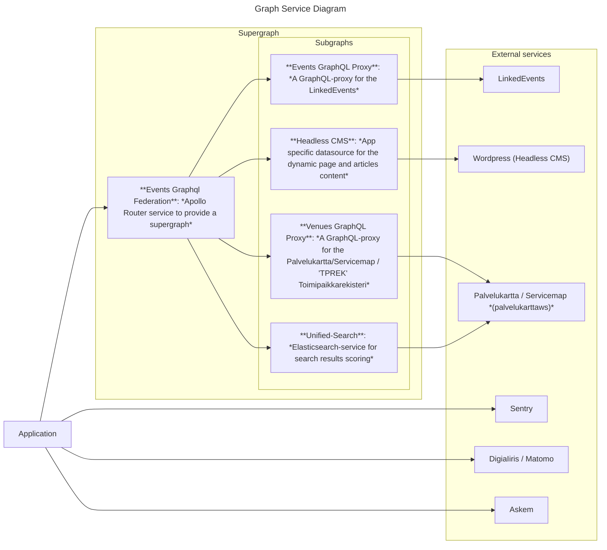

<!-- START doctoc generated TOC please keep comment here to allow auto update -->
<!-- DON'T EDIT THIS SECTION, INSTEAD RE-RUN doctoc TO UPDATE -->
**Table of Contents**  *generated with [DocToc](https://github.com/thlorenz/doctoc)*

- [Events-Helsinki](#events-helsinki)
  - [Service architecture](#service-architecture)
    - [Headless CMS datasources](#headless-cms-datasources)
    - [Route (pages)](#route-pages)
  - [Developing locally](#developing-locally)
  - [Setting up Husky pre-commit hooks:](#setting-up-husky-pre-commit-hooks)
  - [Available scripts](#available-scripts)
    - [`yarn dev`](#yarn-dev)
    - [`yarn build`](#yarn-build)
    - [`yarn test`](#yarn-test)
    - [`yarn test:browser`](#yarn-testbrowser)
    - [`yarn lint`](#yarn-lint)
    - [`yarn typecheck`](#yarn-typecheck)
    - [`yarn generate:graphql`](#yarn-generategraphql)
  - [Headless CMS React Component (HCRC) -library implementation](#headless-cms-react-component-hcrc--library-implementation)
    - [Apollo Link (Middleware)](#apollo-link-middleware)
  - [Application configuration](#application-configuration)
  - [Event Search -parameters](#event-search--parameters)
    - [Parameters conversion when querying LinkedEvents through Events GraphQL Proxy](#parameters-conversion-when-querying-linkedevents-through-events-graphql-proxy)
    - [Main event search](#main-event-search)
    - [Similar events](#similar-events)
    - [Sub events](#sub-events)
  - [Learn more](#learn-more)

<!-- END doctoc generated TOC please keep comment here to allow auto update -->

# Events-Helsinki

Test server: https://tapahtumat.test.hel.ninja

Staging server: https://tapahtumat.stage.hel.ninja

Production server: https://tapahtumat.hel.fi (NOTE: this production server might still be deployed from the old Tapahtumat-repo)

This is a [Next.js](https://nextjs.org/) project originally bootstrapped with [`create-next-app`](https://github.com/vercel/next.js/tree/canary/packages/create-next-app), but cloned from the Hobbies-Helsinki.

## Service architecture

The service consists of:

- **[Events-Helsinki](https://github.com/City-of-Helsinki/events-helsinki-monorepo/apps/events-helsinki):** The NextJS / React application. Integrates to a supergraph of Events Feration Router that provides subgraphs to get dynamic CMS content and events.
- **[Events Graphql Federation](https://github.com/City-of-Helsinki/events-helsinki-monorepo/proxies/events-graphql-federation):** [Apollo Router](https://www.apollographql.com/docs/graphos/routing) to provide a supergraph.
- **[Headless CMS](https://github.com/City-of-Helsinki/headless-cms):** Content Management Service that provides dynamic pages and dynamic content for the teachers' UI. It also provides content for the header and the footer. A React component library can be found from https://github.com/City-of-Helsinki/react-helsinki-headless-cms.
- **[LinkedEvents API](https://github.com/City-of-Helsinki/linkedevents):** A city of Helsinki centralized API for events.
- **[Unified Search](https://github.com/City-of-Helsinki/unified-search):** Provide search service for venues.
- **[Palvelukartta / Servicemap](https://www.hel.fi/palvelukarttaws):** Provides details for venues. (NOTE: https://palvelukartta.hel.fi is used to fetch a map component. https://www.hel.fi/palvelukarttaws is used to fetch all the details)
- **[Digia Iiris](https://iirishelp.digia.com/):** Web analytics (a [Matomo](https://matomo.org/) service).
- **[Sentry](https://sentry.io/):** A monitoring service.
- **[Askem](https://www.askem.com/):** A website feedback collection and analysis tool.



### Headless CMS datasources

- Test / Staging: https://tapahtumat.app-staging.hkih.hion.dev/graphql ([Wordpress-admin](https://tapahtumat.app-staging.hkih.hion.dev/wp-admin/))
- Production: https://tapahtumat.content.api.hel.fi/wp-admin/graphql ([Wordpress-admin](https://tapahtumat.content.api.hel.fi/wp-admin/wp-admin/))

### Route (pages)

The pages are served with some server side rendering (SSR) mechanism to offer better search engine optimization (SEO) and fast user-friendly UI.
The pre-rendering process that we mostly use here is SSG - "automatically generated as static HTML + JSON (uses getStaticProps)".
The server side rendered pages are under the [pages](./src/pages/) -directory. More about NextJS's data fetching in https://nextjs.org/docs/basic-features/data-fetching/overview.

There are some rules that a content manager must follow while maintaining the CMS:

1. **/ (The root path / the front page)**: [The root path](./src/pages/index.tsx) is set as a landing page and it acts as a home page or the front page. The slug for this page must be an empty string, so the uri is `/` in every language.
2. **/search (The search page)**: [The search page](./src/pages/search/index.tsx) gets no content from the CMS, except the SEO information. The uri for this page must be `/search` in every language. It is translated to different languages with the [i18nRoutes.config.json](./i18nRoutes.config.js) configuration file.
3. **/article-archive (The article archive page)**: [The article archive page](./src/pages/articles/index.tsx) gets the SEO content from the CMS and also makes some hardcoded article search queries there. The page is mostly rendered with the components that the HCRC-lib offers. The uri must be `/article-archive` in every language. It is translated to different languages with the [i18nRoutes.config.json](./i18nRoutes.config.js) configuration file.
4. **/pages (The root for the dynamic pages)**: All [the dynamic pages](./src/pages/pages/%5B...slug%5D.tsx) must be children of the `/pages` -root-page. This strategy must be followed so that the application can internally handle the dynamic CMS pages. The path is translated to different languages with the [i18nRoutes.config.json](./i18nRoutes.config.js) configuration file.

## Developing locally

Run the development server:

```
yarn dev
# or
docker compose up
```

Open [http://localhost:3000](http://localhost:3000) with your browser to see the result.

## Setting up Husky pre-commit hooks:

1. Run `yarn install` and `yarn postinstall` on project root.
2. Try `git commit -m foo`. It does not commit anything for real but pre-commit hook should be triggered.

## Available scripts

### `yarn dev`

Runs the application in development mode.
Open [http://localhost:3000](http://localhost:3000) to view in the browser.

The page will reload if you make changes.

### `yarn build`

Builds the production application in the `.next` folder.
Production build can be run locally with `yarn start`.

### `yarn test`

Launches the test runner in the interactive watch mode.

### `yarn test:browser`

Launches the Testcafe test runner for browser tests in the interactive watch mode. `yarn test:browser:ci` runs the command line tool without the graphical interface.

### `yarn lint`

Runs the eslinter, a static code analysis tool to flag programming errors, bugs, stylistic errors and suspicious constructs.
Running the `yarn lint-fix` also fixes the automatically fixamble issues.

### `yarn typecheck`

Transpiles the TypeScript code and reports the errors.

### `yarn generate:graphql`

Uses the codegen tool to generate Graphql Schema file out from the graphql files inside the app. Note that the [graphql.tsx](../../packages/components/src/types/generated/graphql.tsx) inside the packages/components -directory contains the common types and hooks, so you should always copy the generated result and override the graphql file in the common components-package.

## Headless CMS React Component (HCRC) -library implementation

Events uses a lot of the components from the HCRC-lib. For example the article and event carousels are rendered with the HCRC-lib components.

### Apollo Link (Middleware)

> Apollo Link is designed from day one to be easy to use middleware on your requests. Middlewares are used to inspect and modify every request made over the link, for example, adding authentication tokens to every query. In order to add middleware, you simply create a new link and join it with the HttpLink. - https://www.apollographql.com/docs/react/v2/networking/network-layer/#middleware

There are 2 Apollo-clients in implemented: an Apollo-client for _`Headless CMS` to fetch articles and dynamic pages_ from the CMS and an Apollo-client for _`LinkedEvents` to fetch events_ from the Event-proxy. They both contains URL-fields that are targeted to an external source. Since the content is wanted to be rendered inside the Events app, the URLs needs to be transformed so that they are pointing to an internal path. An Apollo Link is a create place to do the transformation, when the URL context is known. Therefore, the URL should include a hint of the context, e.g a context path like `/articles*` or `/pages*` or a domain e.g `linkedvents.hel.fi`.

The transformation table is in the [AppConfig.ts](./src/domain/app/AppConfig.ts) :

```typescript
class AppConfig {
  // ...
  static get linkedEventsEventEndpoint() {
    return getEnvOrError(
      publicRuntimeConfig.linkedEvents,
      "LINKEDEVENTS_EVENT_ENDPOINT"
    );
  }
  static get cmsArticlesContextPath() {
    return process.env.NEXT_PUBLIC_CMS_ARTICLES_CONTEXT_PATH ?? "/articles";
  }
  static get cmsPagesContextPath() {
    return process.env.NEXT_PUBLIC_CMS_PAGES_CONTEXT_PATH ?? "/pages";
  }
  static get URLRewriteMapping() {
    return {
      [AppConfig.linkedEventsEventEndpoint]: ROUTES.EVENTS.replace(
        "/[eventId]",
        ""
      ),
      [`${AppConfig.cmsOrigin}[/fi|/en|/sv]*${AppConfig.cmsArticlesContextPath}`]:
        ROUTES.ARTICLES.replace("/[...slug]", ""),
      [`${AppConfig.cmsOrigin}[/fi|/en|/sv]*${AppConfig.cmsPagesContextPath}`]:
        "/",
    };
  }
  // ...
}
```

## Application configuration

The application configuration is done via the [AppConfig.ts](./src/domain/app/AppConfig.ts) as much as possible, so there would be a single point to configure it.

## Event Search -parameters

> NOTE: This section easily runs out-of-date.

The event search is always queried from the LinkedEvents API, through the Events GraphQL Proxy.

### Parameters conversion when querying LinkedEvents through Events GraphQL Proxy

The LinkedEvents does not provide a GraphQL API by itself, which is the reason for the Events GraphQL Proxy. The GraphQL API follows different kind of naming rules as the basic REST JSON API, so the parameters needs some conversion. The conversion is done by [the queryBuilder of the Events GraphQL Proxy](https://github.com/City-of-Helsinki/events-helsinki-monorepo/blob/7306a13312afea89a3f7757ca672851870102e69/proxies/events-graphql-proxy/src/schema/event/utils.ts#L11-L63).

The conversion map looks (something) like this:

```js
[
  { key: "event_type", value: params.eventType },
  { key: "internet_based", value: params.internetBased },
  { key: "combined_text", value: params.combinedText },
  { key: "local_ongoing_AND", value: params.localOngoingAnd },
  { key: "local_ongoing_OR", value: params.localOngoingOr },
  { key: "local_ongoing_OR_set1", value: params.localOngoingOrSet1 },
  { key: "local_ongoing_OR_set2", value: params.localOngoingOrSet2 },
  { key: "local_ongoing_OR_set3", value: params.localOngoingOrSet3 },
  { key: "internet_ongoing_AND", value: params.internetOngoingAnd },
  { key: "internet_ongoing_OR", value: params.internetOngoingOr },
  { key: "all_ongoing", value: params.allOngoing },
  { key: "all_ongoing_AND", value: params.allOngoingAnd },
  { key: "all_ongoing_OR", value: params.allOngoingOr },
  { key: "division", value: params.division },
  { key: "end", value: params.end },
  { key: "ends_after", value: params.endsAfter },
  { key: "ends_before", value: params.endsBefore },
  { key: "include", value: params.include },
  { key: "in_language", value: params.inLanguage },
  { key: "is_free", value: params.isFree },
  { key: "keyword", value: params.keyword },
  { key: "keyword_AND", value: params.keywordAnd },
  { key: "keyword_OR_set1", value: params.keywordOrSet1 },
  { key: "keyword_OR_set2", value: params.keywordOrSet2 },
  { key: "keyword_OR_set3", value: params.keywordOrSet3 },
  { key: "keyword!", value: params.keywordNot },
  { key: "language", value: params.language },
  { key: "location", value: params.location },
  { key: "page", value: params.page },
  { key: "page_size", value: params.pageSize },
  { key: "publisher", value: params.publisher },
  { key: "publisher_ancestor", value: params.publisherAncestor },
  { key: "sort", value: params.sort },
  { key: "start", value: params.start },
  { key: "starts_after", value: params.startsAfter },
  { key: "starts_before", value: params.startsBefore },
  { key: "super_event", value: params.superEvent },
  { key: "super_event_type", value: params.superEventType },
  { key: "text", value: params.text },
  { key: "translation", value: params.translation },
  { key: "audience_min_age_lt", value: params.audienceMinAgeLt },
  { key: "audience_min_age_gt", value: params.audienceMinAgeGt },
  { key: "audience_max_age_lt", value: params.audienceMaxAgeLt },
  { key: "audience_max_age_gt", value: params.audienceMaxAgeGt },
  { key: "suitable_for", value: params.suitableFor },
  { key: "ids", value: params.ids },
  // Experimental fields...
  { key: "x_full_text", value: params.xFullText },
  { key: "x_ongoing", value: params.xOngoing },
];
```

### Main event search

The "main events search" component is used in the search page at `/search`.

| parameter         | default value                            | controllable | required | description                                                                                   |
| ----------------- | ---------------------------------------- | ------------ | -------- | --------------------------------------------------------------------------------------------- |
| eventType         | ["General"]                              | -            | x        | Select only "general" type events                                                             |
| include           | ['keywords', 'location']                 | -            | x        | Fetch related data from datasource                                                            |
| pageSize          | 10                                       | -            | x        | How many items are fetched per page                                                           |
| division          | "ocd-division/country:fi/kunta:helsinki" | -            | x        | Only events in Helsinki                                                                       |
| xOngoing          | true                                     | -            | x        | include the ongoing events                                                                    |
| xFullText         | ""                                       | x            | x        | A text scoring mathcher (title, place, description, ...)                                      |
| sort              | "end_time"                               | x            | x        | Sorting order of the result set. Default is "event end time as ascending"                     |
| start             | "now"                                    | x            | x        | Filter by event starting time                                                                 |
| end               | null                                     | x            | -        | Filter by event ending time                                                                   |
| startsAfter       | ""                                       | x            | -        | Used for "Only evening events", when it will be set to "16"                                   |
| language          | ""                                       | -            | -        | **NOTE:** currently always empty to include events in all languages                           |
| location          | []                                       | x            | -        | Filter by location / venue / place (source: LinkedEvents)                                     |
| keywordAnd        | []                                       | x            | -        | Used for "Only children events" when it will be set to "yso:p4354"                            |
| keywordOrSet2     | []                                       | x            | -        | A list of keywords (e.g categories or premapped categories)                                   |
| keywordNot        | []                                       | x (URL only) | -        | Exclude events with these keywords. Converted to "keyword!" when querying LinkedEvents.       |
| publisher         | ""                                       | x            | -        | Used to find events of 1 specific organisation                                                |
| publisherAncestor | null                                     | x            | -        | Filter events by `publisherAncestor` set to "ahjo:00001" if filtering city of Helsinki events |
| isFree            | ""                                       | x            | -        | Used for "Show only free events" (when it will be set to "true")                              |
| internetBased     | ""                                       | x            | -        | Used for "Show only remote events" (when it will be set to "true")                            |
| superEventType    | ""                                       | -            | -        | Filter by super event types. E.g `['umbrella', 'none']` excludes `"recurring"`                |
| superEvent        | ""                                       | -            | -        | Filter by a specific (super) event id or set to "none" for events without superevent.         |

> See the [parameters conversion](#parameters-conversion-when-querying-linkedevents-through-events-graphql-proxy) to understand how the LinkedEvenst queries are made.

> INFO: To compare the above table to the code (e.g. in case it needs to be updated),
> see events app's [SearchPage](./src/domain/search/eventSearch/SearchPage.tsx).
> The data is fetched with the `useEventListQuery` hook.

### Similar events

The "similar events" component is used in the event details page to find related events.

The used search parameters are the same as in [main event search](#main-event-search), except

1. the page size (`pageSize`) is set to `100`.
2. category keywords are read from the event which details are shown and set to `keyword` -parameter.
3. sorting is always by event's end time (ascending)

### Sub events

The "sub events" component is used in the event details page to find sub events if the event is super event for some other events.

The parameters being used are:

| parameter  | default value                                       | description                                                               |
| ---------- | --------------------------------------------------- | ------------------------------------------------------------------------- |
| eventType  | ["General"]                                         | Select only "general" type events                                         |
| include    | ["in_language", "keywords", "location", "audience"] | Fetch related data from datasource                                        |
|  sort      | "end_time"                                          | Sorting order of the result set. Default is "event end time as ascending" |
| start      | "now"                                               | Filter by event starting time                                             |
| superEvent | the event id of the super event                     | Filter by super event id                                                  |

> See the [parameters conversion](#parameters-conversion-when-querying-linkedevents-through-events-graphql-proxy) to understand how the LinkedEvenst queries are made.

## Learn more

You can learn more in the [NextJs documentation](https://nextjs.org/docs/getting-started).

To learn React, check out the [React documentation](https://reactjs.org/).
