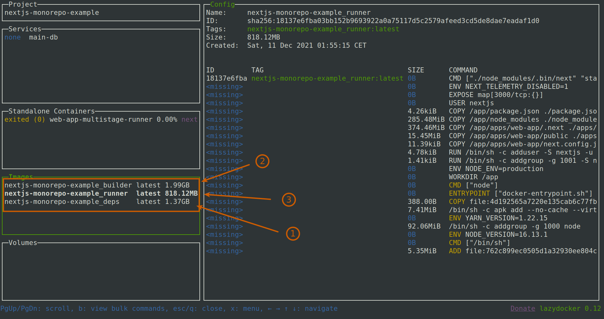

# Docker

**Table of Contents**

<!-- START doctoc generated TOC please keep comment here to allow auto update -->
<!-- DON'T EDIT THIS SECTION, INSTEAD RE-RUN doctoc TO UPDATE -->

- [Introduction](#introduction)
- [Requirements](#requirements)
- [Ready made commands](#ready-made-commands)
- [Develop](#develop)
- [Multistage in details](#multistage-in-details)
  - [Stage 1: deps](#stage-1-deps)
  - [Stage 2: builder](#stage-2-builder)
  - [Stage 3: runner](#stage-3-runner)
- [Cached docker image](#cached-docker-image)
  - [How to build locally](#how-to-build-locally)
- [Remove docker](#remove-docker)
  - [Cleanup](#cleanup)
  - [Complete removal](#complete-removal)

<!-- END doctoc generated TOC please keep comment here to allow auto update -->

## Introduction

A docker with a multi-stage approach to minimize image size
and build time (taking advantage of buildx cache).

```
.
├── apps
│   └── hobbies-helsinki
├── packages
│   ├── core
│   ├── db-main-prisma
│   └── components
├── static
│   ├── assets
│   └── locales
├── .dockerignore
├── docker-compose.hobbies.yml     (specific for hobbies-helsinki)
├── docker-compose.yml             (optional: general services like postgresql...)
└── Dockerfile                     (multistage build for all the apps)
```

## Requirements

- [x] [docker-engine](https://docs.docker.com/get-docker) >= 20.10.0
- [x] docker compose >= 1.29.0
- [x] docker [buildkit](https://docs.docker.com/develop/develop-images/build_enhancements) enabled.
- [x] optional: [lazydocker](https://github.com/jesseduffield/lazydocker), a beautiful tui.
- [x] optional: [dive](https://github.com/wagoodman/dive) to debug layer sizes.

> Note: Be sure to create a [.dockerignore containing at least those entries](https://github.com/City-of-Helsinki/events-helsinki-monorepo/blob/main/.dockerignore).

## Ready made commands

| Yarn script                   | Description                                   |
| ----------------------------- | --------------------------------------------- |
| `yarn docker:hobbies:develop` | Run apps/hobbies-helsinki in development mode |
| `yarn docker:hobbies:install` | Install dependencies in cache mount           |
| `yarn docker:hobbies:build`   | Create a production build                     |
| `yarn docker:hobbies:serve`   | Serve production build on localhost:3000,     |
| `yarn docker:prune-cache`     | **Run this regularly if using in local !!!**  |

> Build and serve commands requires to have a `./apps/hobbies-helsinki/.env.local` present.

## Develop

```bash
yarn docker:hobbies:develop

# Or alternatively
DOCKER_BUILDKIT=1 docker compose -f ./docker-compose.yml -f ./docker-compose.hobbies.yml up develop
```

<details>
  <summary>Want to open a shell to debug ?</summary>
    
  ```bash
  DOCKER_BUILDKIT=1 docker compose -f ./docker-compose.hobbies.yml run --rm develop sh
  ```
  
</details>

## Multistage in details

See the latest [./docker-compose.hobbies.yml](https://github.com/City-of-Helsinki/events-helsinki-monorepo/blob/main/docker-compose.hobbies.yml)
and [./Dockerfile](https://github.com/City-of-Helsinki/events-helsinki-monorepo/blob/main/docker-compose.hobbies.yml).

PS: The goal of multistage is mainly to reduce the size of the resulting image, it also allows to skip deps stage (ie: install deps) when no changes are detected in your deps (lock file).

> Note: The Kolga tools picks the last stage by default, so the production builder should be the last stage in the Dockerfile.



### Stage 1: deps

This stage will install the monorepo and make all node_modules folders available in later
stages.

<details>
  <summary>Some commands</summary>
   
  To build it independently
    
  ```bash
  DOCKER_BUILDKIT=1 docker compose -f docker-compose.hobbies.yml build --progress=tty deps
  # docker buildx bake -f docker-compose.hobbies.yml --progress=tty deps
  ```
    
  To force a rebuild
    
  ```bash
  DOCKER_BUILDKIT=1 docker compose -f docker-compose.hobbies.yml build --no-cache --force-rm --progress=tty deps
  ```
    
  Want to open a shell into it ?
    
  ```bash
  DOCKER_BUILDKIT=1 docker compose -f docker-compose.hobbies.yml run --rm deps sh
  ```

</details>

### Stage 2: builder

This stage will automatically run the deps stage and copy all installed node_modules folder.
Then build the thing and remove devDependencies.

> PS: You'll have to send some build-args (env variables) in order to have a real build.

<details>
  <summary>Some commands</summary>
  To build it independently
  
  ```bash
  DOCKER_BUILDKIT=1 docker compose -f docker-compose.hobbies.yml build --progress=tty builder
  # docker buildx bake -f docker-compose.hobbies.yml --progress=tty builder
  ```
  
  To force a rebuild
  
  ```bash
  DOCKER_BUILDKIT=1 docker compose -f docker-compose.hobbies.yml build --no-cache --force-rm --progress=tty builder
  ```
  
  Want to open a shell into it ?
  
  ```bash
  DOCKER_BUILDKIT=1 docker compose -f docker-compose.hobbies.yml run --rm builder sh
  ```

</details>

### Stage 3: runner

Launch a production build and listen by default to http://localhost:3000.

```bash
DOCKER_BUILDKIT=1 docker compose -f docker-compose.hobbies.yml --env-file .env.secret up runner
```

> PS: you'll have to provide your own .env with required runtime variables.

<details>
  <summary>Some commands</summary>
  To build it independently
  
  ```bash
  DOCKER_BUILDKIT=1 docker compose -f docker-compose.hobbies.yml build --progress=tty runner
  # docker buildx bake -f docker-compose.hobbies.yml --progress=tty runner
  ```
  
  To force a rebuild
  
  ```bash
  DOCKER_BUILDKIT=1 docker compose -f docker-compose.hobbies.yml build --no-cache --force-rm --progress=tty runner
  ```
  
  Want to open a shell into it ?
  
  ```bash
  DOCKER_BUILDKIT=1 docker compose -f docker-compose.hobbies.yml run --rm runner sh
  ```
  
</details>

## Cached docker image

The Openshift environment (that the project uses) does not support caching of the multistage builds. Because of that, we are first creating a cache image out of the deps that the apps needs. We then use the cached image as a base for the actual runner image.

There are 2 different apps related docker files:

1. [Dockerfile](../../Dockerfile), to define a multistage (deps, builder, runner) image for the apps
2. [DockerfileCache](../../DockerfileCache), to define a cache image for the apps dependencies, which can be used as a base image when building the app image multiple times in the CI pipelines.

### How to build locally

Using the Sports-Helsinki app as an example.

Build the cache-image (for the Sports-Helsinki app):

```
docker compose -f docker-compose.sports.yml --env-file ./apps/sports-helsinki/.env.local build cache
```

Build the app runner image (for the Sports-Helsinki app) by using the cache-image as a base image:

```
BUILDER_FROM_IMAGE=events-helsinki-monorepo-cache:latest docker compose -f docker-compose.sports.yml --env-file ./apps/sports-helsinki/.env.local build runner
```

## Remove docker

### Cleanup

| Option                  | Command                                              |
| ----------------------- | ---------------------------------------------------- |
| Prune buildx            | `docker buildx prune`                                |
| Prune cachemount caches | `docker builder prune --filter type=exec.cachemount` |
| Remove all containers   | `docker container rm -f $(docker container ls -qa)`  |
| Clean all images        | `docker image rm -f $(docker image ls -q)`           |
| Remove all volumes      | `docker volume rm $(docker volume ls -q)`            |

### Complete removal

Like to remove all docker layers, overlays... **Warning** you'll lose all your data.

```bash
systemctl docker stop
rm -rd /var/lib/docker
systemctl docker start
```
