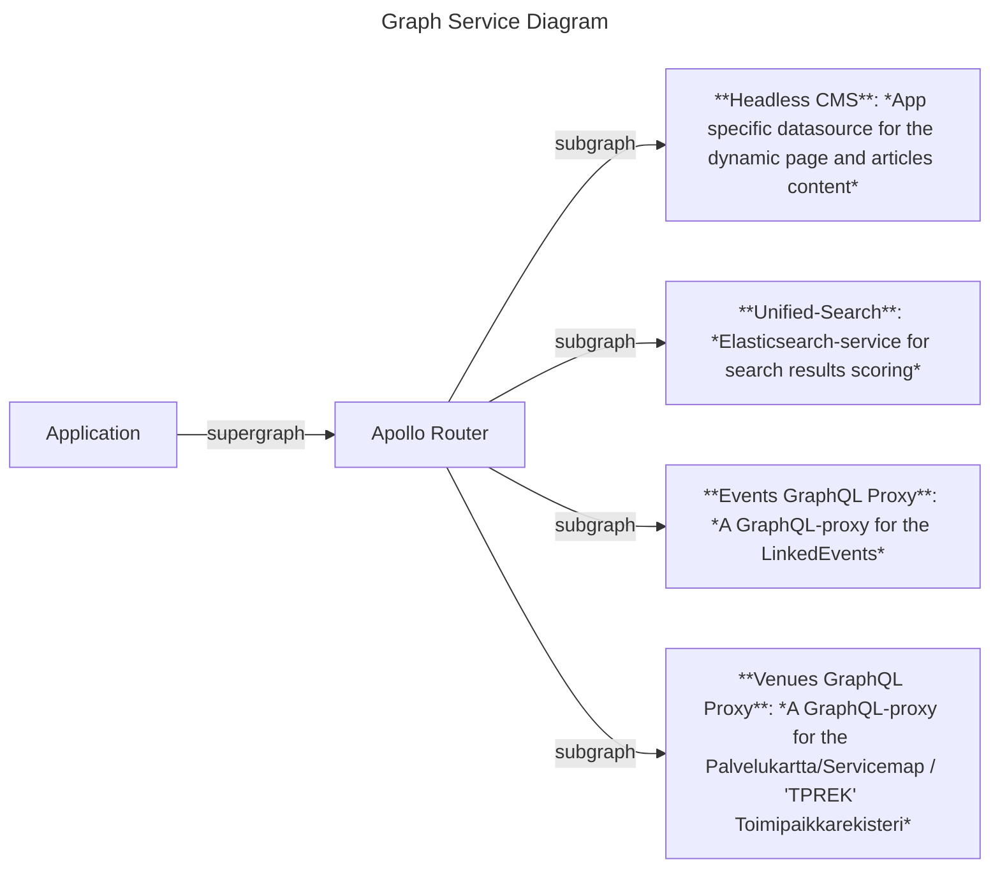

# Events GraphQL Federation

The Events GraphQL Federation is a project for a Apollo federation supergraph (and subgraphs) and the Apollo Router configuration.



**Table of Contents**

<!-- START doctoc generated TOC please keep comment here to allow auto update -->
<!-- DON'T EDIT THIS SECTION, INSTEAD RE-RUN doctoc TO UPDATE -->

- [Subgraphs](#subgraphs)
- [Servers](#servers)
  - [Dev](#dev)
  - [Test](#test)
  - [Staging](#staging)
  - [Production](#production)
- [Local development](#local-development)
  - [Prerequisites](#prerequisites)
  - [Serve dockerized local router](#serve-dockerized-local-router)
  - [Useful Rover commands](#useful-rover-commands)
    - [Work with subgraphs](#work-with-subgraphs)
    - [Work with supergraph](#work-with-supergraph)
- [Router configuration](#router-configuration)
  - [Override the subgraph urls with environment variables](#override-the-subgraph-urls-with-environment-variables)
  - [Headers propagation](#headers-propagation)
- [Documentation related to the Apollo federation](#documentation-related-to-the-apollo-federation)
  - [External articles for basics:](#external-articles-for-basics)
  - [External documentations for graph to subgraph migration and usage:](#external-documentations-for-graph-to-subgraph-migration-and-usage)

<!-- END doctoc generated TOC please keep comment here to allow auto update -->

**For more detailed documentation, please read the documentation maintained by the Apollo team!**

Apollo's Supergraph-demo repository: https://github.com/apollographql/supergraph-demo/

## Subgraphs

- Cms: A graph of the Headless CMS. **Application specific content**. (WARNING: Does not support subgraphs or Apollo federation 2 directives yet). [README](./subgraphs/cms/README.md).
- Events: A subgraph of the LinkedEvents Graphql Proxy. **Common for every app**. [README](./subgraphs/events/README.md)
- Unified-search: A subgraph of the Unified-Search ElasticSearch / OpenSearch service that offers elastic search for Venues. **Common for every app**. [README](./subgraphs/unified-search/README.md)
- Venues: A subgraph of the Venues and Hauki (Venue's open times) information. **Common for every app**. [README](./subgraphs/venues/README.md)

## Servers

The CI deployment process goes like this:

1. When a pull request (PR) is created, the PR related checks are being ran and a new server instance will be created. A link to that environment should be published in the comments of the PR when the service is ready. For example the browser tests are being ran against that server.
2. When a pull request (PR) is merged (to the "main" branch), the dev-environment will be redeployed with the latest changes.
3. When a new release is made, the test-environment and staging-environment will be redeployed with the latest changes.
4. When a new release is approved, a production-environment will be (re)deployed

### Dev

- Hobbies-Helsinki: https://events-graphql-federation-hobbies.dev.hel.ninja/
- Events-Helsinki: https://events-graphql-federation-events.dev.hel.ninja/
- Sports-Helsinki: https://events-graphql-federation-sports.dev.hel.ninja/

### Test

- Hobbies-Helsinki: https://events-graphql-federation-hobbies.test.hel.ninja/
- Events-Helsinki: https://events-graphql-federation-events.test.hel.ninja/
- Sports-Helsinki: https://events-graphql-federation-sports.test.hel.ninja/

### Staging

- Hobbies-Helsinki: https://events-graphql-federation-hobbies.stage.hel.ninja/
- Events-Helsinki: https://events-graphql-federation-events.stage.hel.ninja/
- Sports-Helsinki: https://events-graphql-federation-sports.stage.hel.ninja/

### Production

- Hobbies-Helsinki: https://harrastukset-router.api.hel.fi/
- Events-Helsinki: https://tapahtumat-router.api.hel.fi/
- Sports-Helsinki: https://liikunta-router.api.hel.fi/

## Local development

### Prerequisites

You'll need:

- [docker](https://docs.docker.com/get-docker/)
- [docker-compose](https://docs.docker.com/compose/install/)
- `rover` [Apollo Graphql CLI](https://www.apollographql.com/docs/rover/getting-started)

To install `rover`:

```sh
curl -sSL https://rover.apollo.dev/nix/latest | sh
```

- `router` (optional)

To install `router`:

```sh
curl -sSL https://router.apollo.dev/download/nix/latest | sh
```

> This installs the router executable in your project directory.

To run the router locally with your configuration and supergraph, run:

```sh
./router --config=router.yaml --supergraph=schemas/supergraph.graphql
```

### Serve dockerized local router

In the `package.json` of the root in the monorepo, there is a script that can be used to launch a dockerized Apollo federation router:

```javascript
  "scripts": {
    "docker:graphql-router:hobbies:serve": "cross-env FEDERATION_CMS_ROUTING_URL=https://harrastus.app-staging.hkih.hion.dev/graphql FEDERATION_EVENTS_ROUTING_URL=https://events-graphql-proxy.test.hel.ninja/proxy/graphql FEDERATION_UNIFIED_SEARCH_ROUTING_URL=https://kuva-unified-search.api.test.hel.ninja/search FEDERATION_VENUES_ROUTING_URL=https://venue-graphql-proxy.test.hel.ninja/proxy/graphql docker compose -f docker-compose.router.yml up",
    "docker:graphql-router:events:serve": "cross-env FEDERATION_CMS_ROUTING_URL=https://tapahtumat.app-staging.hkih.hion.dev/graphql FEDERATION_EVENTS_ROUTING_URL=https://events-graphql-proxy.test.hel.ninja/proxy/graphql FEDERATION_UNIFIED_SEARCH_ROUTING_URL=https://kuva-unified-search.api.test.hel.ninja/search FEDERATION_VENUES_ROUTING_URL=https://venue-graphql-proxy.test.hel.ninja/proxy/graphql docker compose -f docker-compose.router.yml up",
    "docker:graphql-router:sports:serve": "cross-env FEDERATION_CMS_ROUTING_URL=https://liikunta.app-staging.hkih.hion.dev/graphql FEDERATION_EVENTS_ROUTING_URL=https://events-graphql-proxy.test.hel.ninja/proxy/graphql FEDERATION_UNIFIED_SEARCH_ROUTING_URL=https://kuva-unified-search.api.test.hel.ninja/search FEDERATION_VENUES_ROUTING_URL=https://venue-graphql-proxy.test.hel.ninja/proxy/graphql docker compose -f docker-compose.router.yml up",
  }
```

To use these, run the following to launch the router:

```sh
yarn docker:graphql-router:hobbies:serve
```

In the `router.yaml` there is a `override_subgraph_url` -configuration that can be used to change the route to another GraphQL-API:

```yaml
override_subgraph_url:
  cms: ${env.FEDERATION_CMS_ROUTING_URL}
  events: ${env.FEDERATION_EVENTS_ROUTING_URL}
  unified-search: ${env.FEDERATION_UNIFIED_SEARCH_ROUTING_URL}
  venues: ${env.FEDERATION_VENUES_ROUTING_URL}
```

They are set in the in the `docker-compose.router.yml` like this, with the defaults in the `events` and `unified-search` services, but empty in `cms`:

```yaml
environment:
  - FEDERATION_CMS_ROUTING_URL=${FEDERATION_CMS_ROUTING_URL}
  - FEDERATION_EVENTS_ROUTING_URL=${FEDERATION_EVENTS_ROUTING_URL:-https://events-graphql-proxy.test.hel.ninja/proxy/graphql}
  - FEDERATION_UNIFIED_SEARCH_ROUTING_URL=${FEDERATION_UNIFIED_SEARCH_ROUTING_URL:-https://kuva-unified-search.api.test.hel.ninja/search}
  - FEDERATION_VENUES_ROUTING_URL=${FEDERATION_VENUES_ROUTING_URL:-https://venue-graphql-proxy.test.hel.ninja/proxy/graphql}
```

**This can be used to easily change (the routing url of) the Headless CMS API! So, by providing `FEDERATION_CMS_ROUTING_URL` as a environment variable, the same supergraph schema can be used with a different source of data.**

More details about this pattern can be read from the Apollo documentation: [Subgraph routing URLs](https://www.apollographql.com/docs/router/configuration/overview/#subgraph-routing-urls).

> By default, the Apollo Router extracts the routing URL for each of your subgraphs from the composed supergraph schema you provide it. In most cases, no additional configuration is required.
>
> However, if you do need to override a particular subgraph's routing URL (for example, to handle changing network topography), you can do so in your YAML configuration file with the override_subgraph_url option

### Useful Rover commands

#### Work with subgraphs

To introspect a subgraph, use:

```sh
rover subgraph introspect https://tapahtumat.app-staging.hkih.hion.dev/graphql
```

> NOTE: If the graph is not a subgraph yet, it needs to be migrated to a subgraph. See: [Apollo Federation subgraph specification](https://www.apollographql.com/docs/federation/subgraph-spec/)

To introspect an old monolith graph, use:

```sh
rover graph introspect https://tapahtumat.app-staging.hkih.hion.dev/graphql
```

or to export the result in a file:

```sh
rover graph introspect https://tapahtumat.app-staging.hkih.hion.dev/graphql > my-schema.graphql
```

#### Work with supergraph

To compose a new supergraph, use:

```sh
rover supergraph compose --config ./supergraph-config.yaml
```

## Router configuration

The router configuration is done with `router.yaml` file.

### Override the subgraph urls with environment variables

The URLs of the subgraph can be defined with the environment variables:

```
override_subgraph_url:
  cms: ${env.FEDERATION_CMS_ROUTING_URL}
  events: ${env.FEDERATION_EVENTS_ROUTING_URL}
  unified-search: ${env.FEDERATION_UNIFIED_SEARCH_ROUTING_URL}
  venues: ${env.FEDERATION_VENUES_ROUTING_URL}
```

**Those values will override the values set in `supergraph-config.yaml`.**

### Headers propagation

Configure which headers the Apollo Router sends to which subgraphs: The propagate config enables you to selectively pass along headers that were included in the client's request to the router.

Some of the subgraphs needs some HTTP headers in the request. Here are some examples:

1. The venues-graphql-proxy needs a `Accept-Language` HTTP header in order to return some of the i18n-values properly.
2. The events-graphql-proxy has a feature to ignore some custom graphql errors and the ignoring is done with some custom headers like `'X-Ignored-Error-Code=UNPOPULATED_MANDATORY_DATA'`.

Examples configuration:

```
headers:
  subgraphs:
    venues: # Header rules for just the venues subgraph
      request:
        - propagate: # propagate all headers. Note that Accept-Language is the most important.
            matching: .*
    events: # Header rules for just the events subgraph
      request:
        - propagate: # propagate all headers. Note that there are some custom X-Headers.
            matching: .*
```

# Documentation related to the Apollo federation

## External articles for basics:

- Apollo docs introduction [Introduction to Apollo Federation](https://www.apollographql.com/docs/federation/)
- The what, when, why, and how of federated GraphQL: [The what, when, why, and how of federated GraphQL - LogRocket Blog](https://blog.logrocket.com/the-what-when-why-and-how-of-federated-graphql/)
- API Gateway Pattern using Apollo Graphql: [An API Gateway is a microservice pattern where a separate service is built to sit in front of your…](https://medium.com/tkssharma/an-api-gateway-is-a-microservice-pattern-where-a-separate-service-is-built-to-sit-in-front-of-your-be4b16861d40)

## External documentations for graph to subgraph migration and usage:

- The supergraph: a new way to think about GraphQL: [The supergraph: a new way to think about GraphQL](https://www.apollographql.com/blog/announcement/backend/the-supergraph-a-new-way-to-think-about-graphql/)
- Federation quick start: [Federation quickstart](https://www.apollographql.com/docs/federation/quickstart/local-composition)
- The graph router: [The graph router](https://www.apollographql.com/docs/federation/building-supergraphs/router#composing-the-supergraph-schema)
- Implementing subgraphs with Apollo Server [Implementing a subgraph with Apollo Server](https://www.apollographql.com/docs/federation/building-supergraphs/subgraphs-apollo-server/). This is how to migrate the old monolith Apollo server graphs to a subgraphs. The Apollo Federation subgraph specification must be met!
- Apollo Federation subgraph specification: [Apollo Federation subgraph specification](https://www.apollographql.com/docs/federation/subgraph-spec/)
