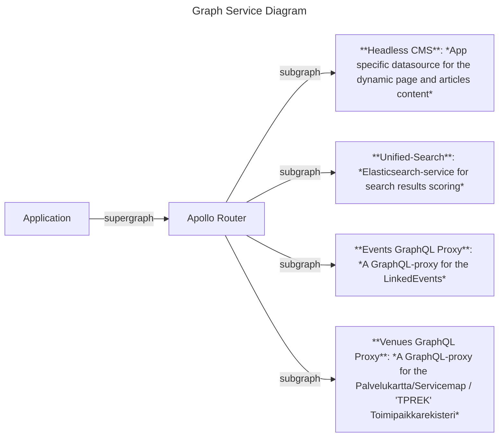

# Event Helsinki GraphQL proxy

**Table of Contents**

<!-- START doctoc generated TOC please keep comment here to allow auto update -->
<!-- DON'T EDIT THIS SECTION, INSTEAD RE-RUN doctoc TO UPDATE -->

- [Environments](#environments)
- [Development with Docker](#development-with-docker)
- [Available Scripts](#available-scripts)
  - [`yarn start`](#yarn-start)
  - [`yarn test`](#yarn-test)
  - [`yarn build`](#yarn-build)
  - [`yarn start`](#yarn-start-1)
  - [`yarn lint`](#yarn-lint)
  - [`yarn format-code`](#yarn-format-code)
  - [`yarn generate:graphql`](#yarn-generategraphql)
- [What to do when interface needs model updates](#what-to-do-when-interface-needs-model-updates)

<!-- END doctoc generated TOC please keep comment here to allow auto update -->

## Environments

**Dev server:** https://venue-graphql-proxy.dev.hel.ninja/proxy/graphql

**Test server:** https://venue-graphql-proxy.test.hel.ninja/proxy/graphql

**Staging server:** https://venue-graphql-proxy.stage.hel.ninja/proxy/graphql

**Production server:** https://venue-graphql-proxy.api.hel.fi/proxy/graphql

The CI deployment process goes like this:

1. When a pull request (PR) is created, the PR related checks are being ran and a new server instance will be created. A link to that environment should be published in the comments of the PR when the service is ready. For example the browser tests are being ran against that server.
2. When a pull request (PR) is merged (to the "main" branch), the dev-environment will be redeployed with the latest changes.
3. When a new release is made, the test-environment and staging-environment will be redeployed with the latest changes.
4. When a new release is approved, a production-environment will be (re)deployed

## Development with Docker

To build the project, you will need [Docker](https://www.docker.com/community-edition).

Building the project

    cp .env.example .env
    docker compose build

Starting the application

    docker compose up -d

GraphQL playground will run on http://localhost:4000/proxy/graphql

## Available Scripts

In the project directory, you can run:

### `yarn start`

Runs the app in the development mode. 
Open [http://localhost:4000/proxy/graphql](http://localhost:4000/proxy/graphql) to view it in the browser.

The page will reload if you make edits. 
You will also see any lint errors in the console.

### `yarn test`

Launches the test runner

### `yarn build`

Builds the app for production to the `build` folder.

### `yarn start`

Runs the graphql proxy in the production mode.
Open [http://localhost:4000/proxy/graphql](http://localhost:4000/proxy/graphql) to view it in the browser.

### `yarn lint`

Run eslint to all files on

### `yarn format-code`

Fix all the eslint errors

### `yarn generate:graphql`

Use `graphql-codegen` (with [codegen.yml](codegen.yml) as configuration file) to generate TypeScript types from `typeDefs.ts` files with `gql` syntax.
When you modify the graphql ttype definitions (in typeDefs.ts files), you should generate the TS types with `yarn generate:graphql` as well.

## What to do when interface needs model updates

When Events monorepo GraphQL interface needs any changes, the graphs needs updates in a proxy, router, apps (and possibly in shared component libraries).

See architect diagram:

> NOTE: Remember that in [the monorepo's root package.json](../../package.json) , there are some docker compose scripts, like `docker:venue-graphql-proxy` and `docker:graphql-router:hobbies:serve` to launch dockerized services.

** What to do in graphql proxy **

1. Update type definitions (add new fields, rename or remove old fields, change field types, etc.) in `typeDefs.ts` file under `./src/schema/**` -directory.
2. Use codegen tools to generate TypeScript types with `yarn generate:graphql`.

** What to do in graphql federation router **

1. Configure subgraph datasources with environment variables. _Note that if you run the router in dockerized env and graphql proxy in your own machine, you need to use `host.docker.internal` instead of `localhost`, since docker container is connecting outside the docker network to the host machine._
2. Update subgraph: Connect router to a proxy where the changes are done and use a tool like Rover to introspect a new schema in to a file.
3. Compose new supergraph: Combine the (changed) subgraphs to a new supergraph. The apps are connected to a GraphQL proxy through a router and it's supergraph.

> See more from [router's README](../events-graphql-federation/README.md) and [router's proxy specific README](../events-graphql-federation/subgraphs/venues/README.md).

** What to do in apps **

1. Connect an app to a router with a new updated supergraph.
2. Update needed queries (and mutations).
3. Use codegen tools to generate TypeScript types with `yarn generate:graphql`. Note, that while the schema is same for every app, the graphql.tsx -file that contains schema, should be copied to [packages/components](../../packages/components/src/types/generated/graphql.tsx).

> See more from app's [README](../../apps/events-helsinki/README.md#yarn-generategraphql).
